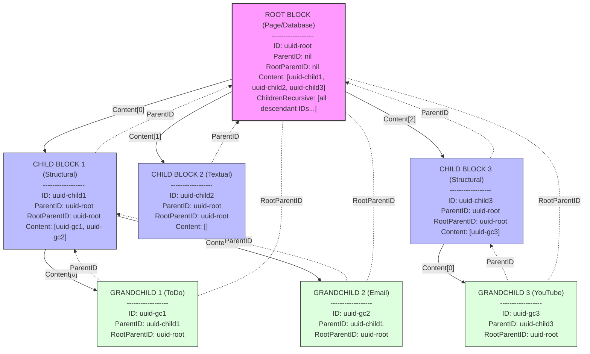

# Blocks

A powerful and flexible entity-based content management system developed by [Cyberbrain](https://github.com/cyberbrain-sh).

## Overview

Blocks is a Go library that provides a versatile foundation for managing structured content as interconnected entity blocks. Unlike traditional block-based systems that focus only on layout and formatting, Blocks represents meaningful real-world entities such as movies, TV series, YouTube videos, Instagram posts, emails, and more.

Each block encapsulates a specific entity type with its relevant metadata, properties, and relationships. This enables rich content modeling beyond simple text formatting, allowing applications to work with semantically meaningful content units that map directly to real-world objects and concepts.

The system supports a wide range of entity types within a unified data model, enabling complex applications that can intelligently process, organize, and present rich media and structured information.

## Features

- **Rich Content Types**: Support for multiple content types including pages, paragraphs, headers, lists, to-do items, links, emails, and media (movies, series, YouTube, Instagram).
- **Hierarchical Structure**: Blocks can contain other blocks, allowing for complex content organization.
- **Properties System**: Flexible properties system for storing metadata associated with each block.
- **Content References**: Ability to reference and link blocks using UUID annotations.
- **Content History**: Track the history of block movements and modifications.
- **Block Rendering**: Utilities for rendering blocks into various formats.
- **Lifecycle Management**: Support for different states in a block's lifecycle.

## Installation

```bash
go get github.com/cyberbrain-sh/blocks
```

## Usage

```go
import "github.com/cyberbrain-sh/blocks/pkg"

// Create a new empty block
block := pkg.NewEmptyBlock()

// Set properties
block.Properties.ReplaceValue(pkg.PropertyKeyTitle, "My Block")
block.Properties.ReplaceValue(pkg.PropertyKeyText, "This is a sample block")

// Add a child block
childID := uuid.New()
block.AppendChild(childID)

// Change block type
block.Type = pkg.TypeParagraph
```

## Block Types

The library supports two main categories of block types:

- **Structural Blocks**: Content blocks with complex structure and rich metadata
  - Movie, Series, Link, ToDo, Email, Page, Database, YouTube, Instagram, Fragment

- **Textual Blocks**: Simple content containers primarily for text
  - Paragraph, Headers (1-6), Bullet List Items, Numbered List Items, Image, Video, Audio, File

## Block Connectivity and Hierarchy

Blocks connect to each other in a hierarchical structure, creating a flexible and powerful content graph:

### Parent-Child Relationships

Each block maintains both upward and downward references:

- **Parent Reference**: Each block (except root blocks) contains a `ParentID` field that points to its parent block. This creates an upward link in the hierarchy.
- **Child References**: Blocks contain a `Content` array of UUIDs that points to their direct children, creating downward links in the hierarchy.

```go
// Example parent-child relationship
parentBlock := pkg.NewEmptyBlock()

childBlock := pkg.NewEmptyBlock()
childBlock.ParentID = &parentBlock.ID  // Child points to parent

parentBlock.AppendChild(childBlock.ID) // Parent includes child in its Content array
```

### Hierarchy Operations

The Block struct provides methods for managing these relationships:

- `AppendChild(id uuid.UUID)` - Adds a child to the end of the Content array
- `RemoveChild(id uuid.UUID)` - Removes a child from the Content array
- `InsertChild(id uuid.UUID, afterID uuid.UUID)` - Inserts a child at a specific position

### Recursive Relationships

For efficient traversal and operations, blocks also maintain:

- `ChildrenRecursive []uuid.UUID` - Contains all descendants (children, grandchildren, etc.)
- `RootParentID *uuid.UUID` - Points to the topmost ancestor in the hierarchy

This dual-reference system (parent references and child content arrays) allows for:
- Fast bidirectional traversal of the content tree
- Easy restructuring of content hierarchies
- Efficient querying of both ancestors and descendants

### Block Hierarchy Diagram

The following diagram illustrates the block hierarchy structure:



The diagram shows:
- **Root Block**: A page or database with no parent
- **Solid Arrows** (→): Represent downward references via the Content array
- **Dashed Arrows** (⇢): Represent upward references via ParentID
- **Dotted-Dashed Arrows** (-.-): Represent direct RootParentID references to the root
- Each block contains its key fields including ID, ParentID, RootParentID, and Content
- Different colored blocks represent different levels in the hierarchy

This structure enables both upward traversal (via ParentID) and downward traversal (via Content array) through the block hierarchy.

## Properties

Blocks have type-specific properties that can be accessed and modified:

```go
// Get a string property
if title, exists := block.Properties.GetString(pkg.PropertyKeyTitle); exists {
    fmt.Println("Title:", title)
}

// Set a property
block.Properties.ReplaceValue(pkg.PropertyKeyChecked, true)
```

## License

[License Information]

## Contributing

[Contribution Guidelines]

## Links

- [Documentation](https://github.com/cyberbrain-sh/blocks)
- [Issues](https://github.com/cyberbrain-sh/blocks/issues)
